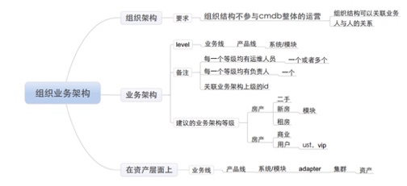

# 1. 组织架构/业务线 数据字典

## bsp_user

 字段			|		类型     | 描述                     | 参考数据
----------  | ---------	|-------------------------|-------
bsp_user_Id | char(22) 	|组织架构中的bsp对应的唯一id| 201103311528293b20b828
name| varchar(50)| 用户名| changzu
real_name|varchar(50) |实际名称|changzhu@58ganji.com
mobile|char(11) |移动电话| 15313485820
tel|varchar(50) |固定电话| 010-51395858-5181
child_tel|varchar(20) |分机号| 6644
gender|char(1) |性别| 1
employee_id|varchar(20)) |人员的工号| 8
qq|varchar(20)|qq|791780345
dpt_id|varchar(20)|qq|791780345
qq|varchar(20)|qq|791780345
bsp_leader_id|char(22)|bsp直属领导|201103311528293b20b828
bsp_dpt_id | char(22) | 组织结构中部门在bsp的id值| 201103311528293b20b828

## t_dpt 

> 组织中的部门结构

 字段			|		类型     | 描述                     | 参考数据
----------  | ---------	|-------------------------|-------
bsp_dpt_id | char(22) 	|组织结构中部门在bsp的id值| 201103311528293b20b828
dpt_level| tinyint| 组织架构中的部门等级| 4
dpt_name|varchar(255) |组织架构中的部门名称| 财务部
bsp_dpt_p_id| char(22)|上级部门的id| 201103311528293b20b829

## t_org_dpt

> 业务与组织之间的关联关系表

 字段|	类型| 描述 | 参考数据
-----| ---|----|-------
id| bigint, pk| id | 1
bsp_dpt_id | bigint | 对应组织部门的主键| 3
org_id| bigint | 关联业务线的中间表的主键| 4

## t_org

> 组织业务线[适用于业务线的等级不稳定时]

 字段			|		类型     | 描述                     | 参考数据
----------  | ---------	|-------------------------|-------
org_id  | bigint pk 	|id, 主键| 1
org_pid  | bigint  | 对应上级的id | 1
org_level| tinyint | 当前对应的等级
org_name | varchar(255)| 当前业务线的名称
org_operator_ids|varchar |业务线运维人员ids|  
org_manager_ids|char | 业务线管理人员ids

### t_cluster

>集群的相关属性

 字段|	类型| 描述 | 参考数据
-----| ---|----|-------
cluster_id  | bigint pk 	|id, 主键| 1
cluster_name | varchar(255)| 集群的名称
cluster_manager_ids|char | 集群的管理人员
org_id | bigint |  |

# 2. 组织架构/业务线 组成图

# 3. ip数据字典

## t_ip_address

>ip 的数据信息

| 字段|	类型| 描述 | 参考数据
|-----| ---|----|-------
|ip_address_id | bigint, pk| 
|ip_address| int |对应具体的IP值 | 1084782657
|assign_time | datetime| IP分配的时间 |
|update_time|datetime |
|ip_status | tinyint | 是否使用, 已分配， 未分配， 已使用, 保留| 0
|asset_id|bigint|对应的资产id|
|ip_type| tinyint | ip的类型｜虚ip/实ip|
|ip_segment_id| bigint| 对应的网段id|1
|ip_assigner| varchar()

# ip 的分配
-
## t_ip_segment 网段表

| 字段|	类型| 描述 | 参考数据
|-----| ---|----|-------
|ip_segment_id | bigint, pk|  网段的id| 1
|ip_segment_address| char |对应的value |10.3.255.42
|ip_segment_netmask|
|ip_segment_isp|
|vlan_id
|ip_segment_gateway|
|ip_segment_broadcast|