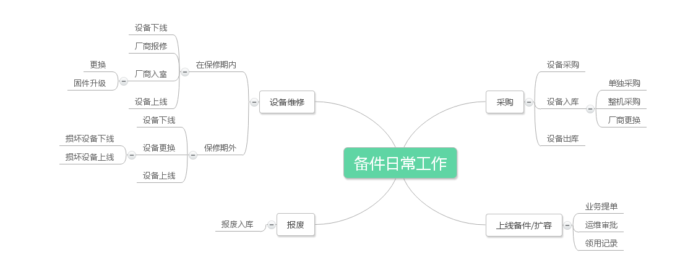
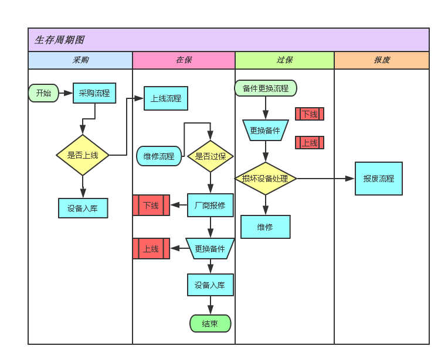

### 备件数据库及流程说明

#### 备注：

* 作者：刘子剑
* email: liuzijian@58ganji.com
* 更新时间：2016-3-4

#### 一. 备件事务思维导图

#### 二. 备件生命周期简图

#### 三. 数据库字段及说明

##### cpu信息表：

t_cpu

|  键值名 |  数据类型  |  描述  | 备注             |
| -------| ----- | ----- | -----------------   | 
| accessory_id |  bigint | 主键   | 数字               |
| cpu_model  | varchar | 型号名称| E5-2630V3)    |
| cpu_core   |  Int    | 核心数  | 数字           |
| cpu_frequency| float | 频率  | 2.4 单位统一GHz |
| cpu_power  |  Int    | 功耗    | 85/105       |
| comment | varchar| 备注    |                  |
| platform_type | varchar| 平台类型 |               |
| cpu_ht_support | tinyint | 是否支持超线程 |        |
| cpu_vm_support | tinyint | 是否支持虚拟化 |        |
| cpu_memory_channel_num | Int | 支持内存通道数量 |        |
| cpu_max_num | Int | 最大协同cpu数量 |        |
| cpu_node_support | tinyint | 是否支持节点模式 |        |
| brand_id | Int     | 厂商 | 品牌表FK         |

##### 内存信息表：

t_memory

|  键值名 |  数据类型  |  描述  | 备注          |
| -------| ----- | ----- | -----------------  | 
| accessory_id|  bigint| 主键   | 数字               |
| memory_capacity | Int  | 容量 |  单位Byte           |
| memory_frequency | Int | 频率 | 1600               |
| memory_model     | varchar | 型号 |                |
| memory_specs  | varchar | 规格 | DDR3              |
| comment | varcha | 备注 | 字符串             |
| brand_id | Int     | 厂商 | 品牌表FK         |
| memory_ecc_support | tinyint | 是否支持ecc校验 |        |
| memory_channel_num | Int | 内存支持通道数 |        |
| memory_max_underclocking | tinyint | 满配是否降频 |        |

##### 硬盘表:

t_disk

|  键值名 |  数据类型  |  描述  | 备注         |
| -------| -----    | ----- | -------------- | 
| accessory_id | bigint | 主键   | 数字              |
| disk_capacity |Int     | 容量   | 统一单位Byte       |
| disk_interface| tinyint    | 接口类型 | 程序枚举          |
| disk_speed    | Int    | 转速     |  数字            |
| disk_size     | float  | 尺寸     | 字符串 (2.5/3.5) |
| comment  | varchar | 备注    | 字符串           |
| disk_model    | varchar | 型号    |                 |
| version  | varchar | 固件版本 |                 |
| brand_id      | Int     | 品牌     | 品牌表FK        |
| bandwidth | Int    | 带宽     |                |
| iops      | Int    | io性能   |                |
| disk_type      | tinyint | 硬盘类型  | 枚举     |
| disk_cache | Int    |  缓存大小   |             |
| disk_chip  | varchar | 芯片类型  |              |
| disk_nand  | Int     | nand容量 |              |
| disk_nand_process | varchar | nand制程 |      |

##### 网卡表:

t_network_card

|  键值名 |  数据类型  |  描述  | 备注         |
| -------| -----    | ----- | -------------- | 
| accessory_id | bigint | 主键   | 数字       |
| speed  | Int      | 速率   | 统一bit标识     |
| network_card_interface| tinyint    | 接口   | 枚举        |
| network_card_chip    | varchar | 芯片   | I350/X540      |
| network_card_model| varchar | 型号   |                |
| comment | varchar | 备注   |                |
| version | varchar | 固件版本 |               |
| brand_id | Int     | 品牌    | 品牌表FK       |
| mac_address | varchar     | mac地址    |       |
| network_card_iscsi_support | tinyint | 是否支持iscsi |    |
| network_card_ncsi_support | tinyint | 是否支持ncsi |    |
| network_card_pxe_support | tinyint  | 是否支持pxe  |    |

##### 电源：

t_power

|  键值名 |  数据类型  |  描述  | 备注         |
| -------| -----    | ----- | -------------- | 
| accessory_id |  bigint | 主键   | 数字            |
| power_model  | varchar | 型号    |                |
| power_specs   | tinyint      | 规格   | 枚举         |
| efficiency | Int  | 功率   | 450 单位W       |
| power_supply | tinyint| 供电模式| 枚举         |
| version | varchar | 固件版本 |                |
| brand_id    | varchar  | 品牌    | 品牌表PK   |

##### 主板表：

t_mother_board

|  键值名 |  数据类型  |  描述  | 备注         |
| -------| -----    | ----- | -------------- |
| accessory_id |  bigint     | 主键   | 数字            |
| mother_board_model  |  varchar | 型号   | 字符串           |
| comment| varchar   | 备注   |                |
| version | varchar | 固件版本 |                |
| brand_id    | Int      | 品牌    | 品牌FK          |
| pci_num    | Int      | pci数量 |                |
| pcie_num  | Int      | pci-e 数量 |             |
| sata_num   | Int      | SATA接口数量 |             |
| sas_num    | Int      | SAS接口数量  |             |
| m_2_num    | Int      | M.2 PCI-E子接口 |          |
| satadom_num | Int     | PCH延伸子接口  |           |
| lom_num     | Int     | 网卡定制接口   |           |
| dimm_num    | Int     | dimm数量   |           |
| mother_board_chip | varchar | 主板芯片  |       |
| sd_support | tinyint   |  是否支持sd卡 |       |
| sata_controller_support | tinyint | 是否支持sata控制器 |  |
| sas_controller_support | tinnyint | 是否支持sas控制器 |   |
| usb_num | Int  |  usb接口数量  |      |
| double_bios_protection_support | tinyint | 双bios冗余保护 |   |
| asset_entry_support | tinyint | 是否支持资产录入 |     |
| command_bios_support | tinyint | 是否支持命令行修改bios |   |

##### 阵列卡:

t_array_card

|  键值名 |  数据类型  |  描述  | 备注         |
| -------| -----    | ----- | -------------- |
| accessory_id | bigint  | 主键   | 数字            |
| array_card_interface | tinyint   | 接口   | 枚举        |
| array_card_cache   | Int     | 缓存   | 单位Byte        |
| array_card_buttery | tinyint     | 是否有电池 | 整形标志位    |
| comment | varchar | 备注      |             |
| version | varchar  | 固件版本  |             |
| brand_id     | Int      | 品牌      | 品牌FK      |
| cache_status | tinyint | 缓存状态 |         枚举  |
| strip_size | Int |   调带大小     |  32/64/128      |
| read_write_ratio | varchar | 读写比例        |
| array_card_model | varchar | 型号   |     |         

##### HBA卡表：

t_hba_card

|  键值名 |  数据类型  |  描述  | 备注         |
| -------| -----    | ----- | -------------- |
| accessory_id | bigint      | 主键   | 数字       |
| hba_card_interface | tinyint   | 接口类型 |    枚举  |
| comment | varchar | 备注      |        |
| version | varchar | 固件版本   |        |
| brand_id |  Int   | 品牌    |   品牌PK |
| hba_card_model | varchar  | 型号  |         |

##### 风扇：

t_fan

|  键值名 |  数据类型  |  描述  | 备注         |
| -------| -----    | ----- | -------------- |
| accessory_id | bigint | 风扇id |  数字           |
| fan_redundancy_level | Int | 冗余级别 |    |
| fan_max_speed | Int  |  最大转速 |       | 
| fan_auto_regulation_support | tinyint | 转速自动调节 |    |
| fan_position | tinyint | 风扇位置  |  枚举  |  

##### 导轨表：

t_guide

|  键值名 |  数据类型  |  描述  | 备注         |
| -------| -----    | ----- | -------------- |
| guide_id | bigint | 数字   |                |
| comment | varchar | 备注  |                 |
| used   | Int      | 使用数量 |               |
| total_count| Int      | 总数量  |            |
| guide_model| varchar      | 导轨类型   |            |

#### GPU表

t_gpu

|  键值名 |  数据类型  |  描述  | 备注         |
| -------| -----    | ----- | -------------- |
| accessory_id | bigint  | 数字   |               |
| gpu_core_num | Int | 核心数量 |           |
| gpu_memory | Int   | 内存大小 |           |
| gpu_frequency | Int | 频率  |             |
| gpu_chip | varchar | 芯片   |             |
| gpu_memory_specs | varchar | 内存规格 | DDR5 |
| gpu_power | Int | 额定功率  |        |
| gpu_idle_power | Int | 空闲功率 |        |
| gpu_memory_bandwidth | Int | 内存带宽 |   |
| brand_id |  Int   | 品牌    |   品牌PK |

##### 品牌表

t_accessory_brand

|  键值名 |  数据类型  |  描述  | 备注         |
| -------| -----    | ----- | ------------ |
| brand_id |  bigint | 品牌ID |             |
| brand_name   |  varchar | 品牌名称 |      |

##### 配件表

t_accessory

| 键值名   | 数据类型 | 描述 | 备注 |  
| ----- | ----- | -----   | ----- | 
| accessory_id | bigint | 配件id |      |
| accessory_type_id | Int | 配件类型id|外键与各个配件类型表关联 |
| accessory_status |Int | 配件状态  | 枚举     |
| idc_id | Int  | idcid | 属于哪个idc |
| sn     | Int    | 资产sn号 |            |
| enable_time | datetime | 启用时间 |         |
| due_time | datetime | 过保时间   |         | 
| store_id | Int     | 备件库Id   |         | 

##### 配件类型表

t_accessory_type

| 键值名            | 数据类型 | 描述 | 备注 |  
| ---------------  | -----   | ----- | ----- | 
| accessory_type_id | bigint | 配件类型表id |    |
| accessory_type_name | varchar | 配件类型名 |   |

##### 配件库表

t_accessory_store

| 键值名            | 数据类型 | 描述 | 备注 |  
| ---------------  | -----   | ----- | ----- | 
| accessory_store_id | bigint | 配件库表id |    |
| accessory_store_name | varchar | 配件库名 |   |
| accessory_store_position | varchar | 配件位置 |
| accessory_store_owner | varchar  | 配件负责人 |