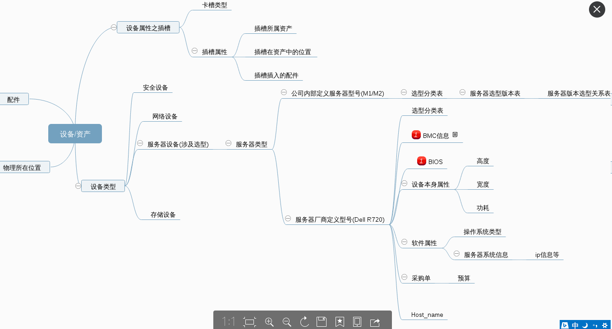

# 设备组织关系

Date: 2016-02-25 15:10
Modified: 2016-03-02 11:20
Author:李静波 @ 系统运维部

## 涉及流程

 * 设备选型:
公司内部根据服务器进行测试评分，内部对各个厂商提供的服务器具体型号进行定义服务器类型

** 需要注意hostname与业务相关映射 **

## 服务器表

t_server

| 字段   | 类型 | 描述 | 备注 |  
| :----- | :----- | :----- | :----- | 
| server_id | bigint,PK | 服务器id编号 | |
| asset_id | bigint,FK | 资产编号 | 外键与资产表关联 | 
| inc_server_type_id | bigint,FK | 公司内部设备选型类型 |例如：M1等 | 
| server_status | tinyint | 服务器状态 | 启用等状态 | 
| server_comment | text | 备注信息 | 
| server_device_type_id | bigint,FK | 服务器属性与服务器类型表关联 | |
| server_bios_os | varchar | bios | |
| server_bmc | varchar| bmc | |
| server_host_name | varchar | hostname | |
| os_type_id |bigint,FK| 操作系统类型id| |
| server_kernel_version | varchar | 内核版本 | |
| server_ads_status | varchar | ads校验状态 | |
| server_ads_check_time | datetime | ads校验时间 | |
| server_ads_installed | tinyint | 是否安装ads | |
| server_ads_update_time | datetime| 系统状态更新时间 | |

##  内部选型表

t_inc_server_type

** 此表需字段需要扩充 **

| 字段   | 类型 | 描述 | 备注 |  
| :----- | :----- | :----- | :----- | 
| inc_server_type_id |bigint,PK | 服务器内部选型id | |
| inc_server_type_name |varchar| 服务器内部选型类型名称| |
| inc_server_code |varchar | 服务器内部选型代码 | |

## 服务器设备类型表

t_server_device_type

| 字段   | 类型 | 描述 | 备注 |  
| :----- | :----- | :----- | :----- | 
| server_type_id |bigint,PK | 服务器设备类型id | |
| device_producer_type_id | bigint,FK| 设备提供商类型表 | 外键与设备提供商类型表|
| server_device_type_name | varchar | 服务器设备型号名称/dell r720 | |
| server_hight | int | 服务器高度 | |
| server_width | int | 服务器宽度 | |
| server_depth | int | 服务器深度 | |
| server_electricity | varchar | 型号平均功耗 | |
| server_weight | int | 服务器重量 | |
| server_score | varchar | 服务器综合性能 | |
| server_minios | varchar | minos性能 | |
| server_max_power | int | 最大功率 | |
| server_rated_power | int | 额定功率 | |
| server_power_type | varchar | 供电类型 | |
| server_mother_board_type_id | bigint, FK| 主板类型id | |

## 操作系统类型表

t_os_type

| 字段   | 类型 | 描述 | 备注 |  
| :----- | :----- | :----- | :----- | 
| os_type_id |bigint ,PK | 操作系统类别id | |
| os_type_name |varchar| 操作系统类别名|linux/windows |
| os_type_version | varchar | 操作系统版本 | |
| os_full_name | varchar | 操作系统详细名称 | |
| os_default_version | varchar | 内核版本 | |

## 网络接口

t_network_interface

| 字段   | 类型 | 描述 | 备注 |  
| :----- | :----- | :----- | :----- | 
| network_interface_id | bigint ,PK | 网络接口id | |
| server_id |bigint ,FK | 服务器id | |
| network_interface_name | varchar | 网络接口名 | eth0 |
| network_interface_type |tinyint | 网络接口类型 | eth0/eth0:1 |

## 网络接口配置表

t_network_interface_config

| 字段   | 类型 | 描述 | 备注 |  
| :----- | :----- | :----- | :----- | 
| network_interface_config_id | bigint ,PK | 网络接口配置id | |
| network_interface_id | bigint ,FK | 网络接口id | |
| nic_port_id | bigint,FK | 网口id |  |
| network_interface_tranfer_type | tinyint | 配置类型 | eth/bond-mode |

## 网络接口ip关系表

t_network_interface_ip

| 字段   | 类型 | 描述 | 备注 |  
| :----- | :----- | :----- | :----- | 
| network_interface_ip_id | bigint ,PK | 网络接口ip id | |
| network_interface_id | bigint ,FK | 网络接口id | |
| ip | varchar | ip | ip依赖ip表 |

## 设备提供商类型表

t_device_producer_type

| 字段   | 类型 | 描述 | 备注 |  
| :----- | :----- | :----- | :----- | 
| device_producer_type_id | bigint,PK | 设备制造商类型id | |
| producer_name | varchar| 设备制造商名| |
| producer_id | bigint | 设备提供商id | |
| device_type |tinyint | 设备类型/net/server....| |

## 服务器选型关系表

t_server_selection

| 字段   | 类型 | 描述 | 备注 |  
| :----- | :----- | :----- | :----- | 
| server_selection_id |bigint,PK | 服务器选型id | |
| inc_server_type_id |bigint,FK| 公司型号类别id| 外键与公司选型表关联|
| server_device_type_id |bigint,FK| 设备本身类型型号id |外键与服务器设备类型表关联|
| device_producer_type_id |bigint,FK| 设备提供商类id |外键与内部选型表关联 |
| server_selection_datetime | datetime | 选型迭代时间 | |

## 服务器选型版本表

t_selection_version

| 字段   | 类型 | 描述 | 备注 |  
| :----- | :----- | :----- | :----- | 
| server_selection_version_id |bigint,PK | 服务器选型版本id | |
| server_selection_version_start_time | datetime | 服务器选型版本开始时间 | |
| server_selection_version_end_time | datetime | 服务器选型版本结束时间 | |
| server_selection_version_author_id | bigint,FK | 服务器选型版本作者id | |
| server_selection_versionnumber | varchar | 服务器选型版本名称 | |

## 服务器选型版本关系表

t_selection_version_record

| 字段   | 类型 | 描述 | 备注 |  
| :----- | :----- | :----- | :----- | 
| server_selection_version_record_id |bigint,PK | 服务器选型版本记录id | |
| server_selection_version_id | bigint,FK | 服务器选型版本id | |
| server_selection_id | bigint,FK | 服务器选型id | |

## 卡槽表

t_slot

| 字段   | 类型 | 描述 | 备注 |  
| :----- | :----- | :----- | :----- | 
| slot_id |bigint,PK | 卡槽id | |
| access_id |bigint,FK| 固资id| 外键与固资表关联|
| slot_type_id |bigint,FK| 卡槽类型id |外键与卡槽类型表关联|
| slot_num |varchar| 卡槽位置编号 |例如：插在第一号盘位 |
| slot_face_direction | tinyint | 卡槽方向 | | 
| insert_accessory_id |bigint| 卡槽所插入配件id |与配件表id强一致|

## 卡槽类型表

t_slot_type

| 字段   | 类型 | 描述 | 备注 |  
| :----- | :----- | :----- | :----- | 
| slot_type_id |bigint,PK | 卡槽类型id | |
| slot_type_name |varchar| 卡槽名 | |
| slot_spec | tinyint | 卡槽规格 | |

## 资产表

t_asset

| 字段   | 类型 | 描述 | 备注 |  
| :----- | :----- | :----- | :----- | 
| asset_id |bigint,PK | 固资资产id | |
| asset_sn |varchar| 设备sn | |
| asset_is_device | bit | 是否为设备 | |
| asset_instock_time | date | 入库时间 | |
| asset_first_use_time | date | 启用时间 | |
| asset_outstock_time | date | 出库时间 | |
| asset_warranty_due_time | date | 过保时间 | |
| asset_receipt_time | date | 购买时间 | |
| asset_on_shelf_time | date | 上架时间 | |
| asset_off_shelf_time | date | 下架时间 | |
| asset_last_update_time | date | 最后更新时间 | |
| asset_status | tinyint | 状态 | |
| asset_comment | text | 备注 | |
| asset_position_id | bigint,FK | 位置id | |
| asset_device_type | tinyint | 固资设备类型 | |
| order_item_id | bigint,FK | 订单条目id | |
| asset_ower_id | bigint,FK | 主负责人id | |
| asset_backup_ower_id | bigint,FK | 备负责人id | |
| asset_belong_org_id | bigint,FK | 归属组织id | |
| asset_operator_id | bigint,FK | 运维主负责人id | |
| asset_backup_operator_id | bigint,FK | 运维备负责人id | |
| asset_operator_org_id | bigint,FK | 运维部门id | |