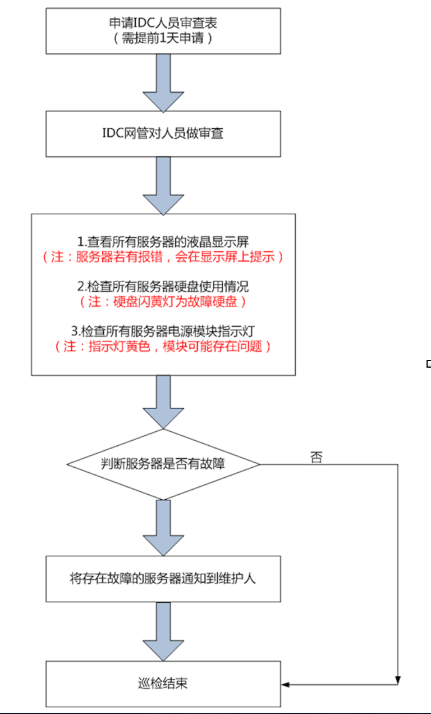

### 进机房流程规范
======================
* 需要进入IDC的维护人员，必须在IDC服务平台申请人员审查表（网址：http://idc.edatahome.com/pleaselogin.jsp?m=501）
* 在申请人员审查表时，必须使用真实证件号码和姓名，选择正确的操作时间
* 向陆杜鑫拿取服务器巡检任务清单，可以根据实际情况添加巡检任务，但严谨私自删除任务
* 向"<dl-tech-ops@anjuke.com>“发送任务清单及维护人员信息
* 进入机房必须携带本人身份证，配合机房网管人员进行检查
* 不能携带饮料和水进入机房，机房内不准喝水，抽烟

### 流程图
======================
